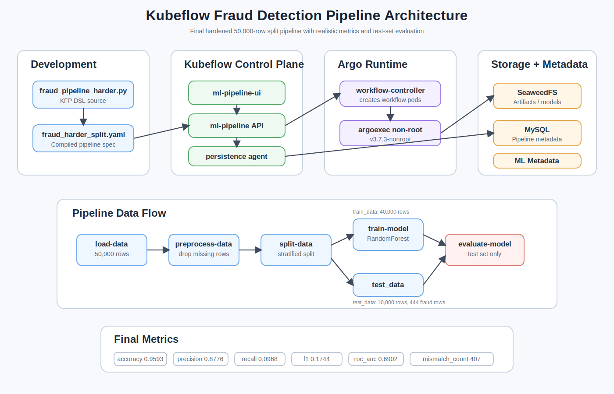
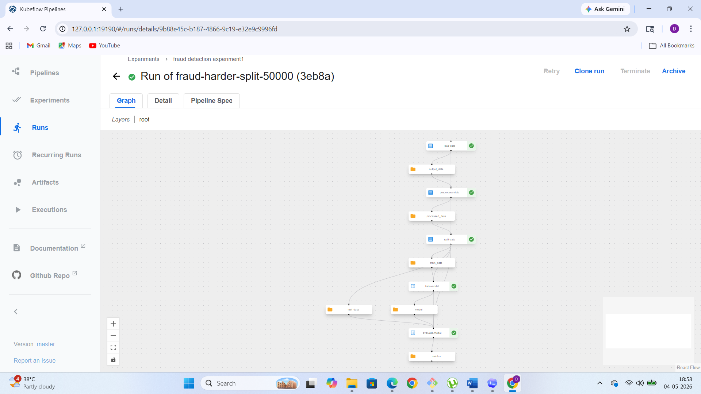
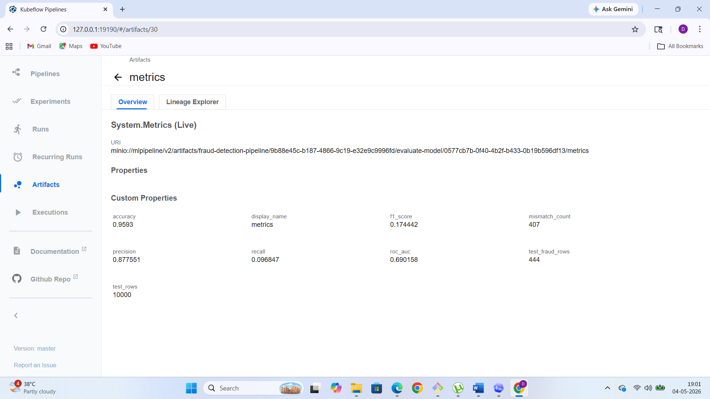
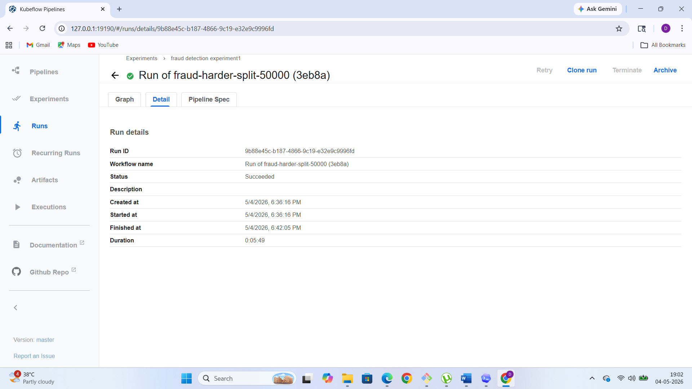

# Kubeflow Fraud Detection Pipeline

This project builds and runs an end-to-end fraud detection workflow on Kubeflow Pipelines. The pipeline is written with the KFP DSL, compiled to YAML, uploaded to Kubeflow, and executed on Kubernetes through Argo Workflows.

The final working pipeline is the hardened split version:

- Pipeline name: `fraud-harder-split-50000`
- Compiled YAML: `fraud_harder_split.yaml`
- Successful run: `Run of fraud-harder-split-50000 (3eb8a)`
- Run ID: `9b88e45c-b187-4866-9c19-e32e9c9996fd`
- Final state: `SUCCEEDED`

## Why This Pipeline Exists

Fraud detection is an imbalanced classification problem. A model can show high accuracy by mostly predicting the non-fraud class, so the pipeline logs precision, recall, F1, ROC AUC, fraud row counts, and mismatch count instead of relying only on accuracy.

The first version of the pipeline produced unrealistically perfect metrics. The final version makes the synthetic dataset harder and verifies that evaluation is done on the test split, not training data.

## Final Architecture

The system has four layers:

| Layer | What It Contains | Responsibility |
|---|---|---|
| Development layer | `fraud_pipeline_harder.py`, `fraud_harder_split.yaml` | Define and compile the KFP pipeline |
| Kubeflow control plane | `ml-pipeline-ui`, `ml-pipeline`, `workflow-controller` | Register pipelines, create runs, launch Argo workflows |
| Runtime layer | Pipeline pods for `load-data`, `preprocess-data`, `split-data`, `train-model`, `evaluate-model` | Execute ML workflow steps |
| Storage and metadata layer | SeaweedFS / MinIO-compatible storage, MySQL, ML Metadata | Store artifacts, run metadata, lineage, and metrics |

The static diagram below is included so the architecture is visible in README viewers that do not render Mermaid diagrams.



Architecture diagram file:

```text
C:/Users/abcom/Documents/Codex/2026-05-02/i-want-have-fraud-detecrion-in/screenshots/architecture-diagram.svg
```

The architecture path is:

```text
Developer -> fraud_pipeline_harder.py -> fraud_harder_split.yaml
Kubeflow UI -> ml-pipeline API -> Argo Workflow Controller
Argo -> load-data -> preprocess-data -> split-data -> train-model -> evaluate-model
Pipeline pods -> SeaweedFS artifact store + ML Metadata
evaluate-model -> Kubeflow metrics artifact
```

## Component Architecture

| Area | Components |
|---|---|
| Development | `fraud_pipeline_harder.py`, `fraud_harder_split.yaml` |
| Kubeflow Pipelines | `ml-pipeline-ui`, `ml-pipeline API`, `mysql`, `ml-pipeline-persistenceagent` |
| Argo Workflows | `workflow-controller`, `argoexec:v3.7.3-nonroot` |
| Pipeline runtime pods | `load-data`, `preprocess-data`, `split-data`, `train-model`, `evaluate-model` |
| Storage and metadata | `seaweedfs` / MinIO-compatible artifacts, `metadata-grpc`, `metadata-envoy` |

## Runtime Sequence

1. Developer uploads `fraud_harder_split.yaml` in the Kubeflow Pipelines UI.
2. `ml-pipeline` registers the pipeline and stores metadata in MySQL.
3. A one-off run creates an Argo Workflow.
4. Argo starts the root driver and then executes the pipeline pods in dependency order.
5. Each step writes artifacts to SeaweedFS / MinIO-compatible storage.
6. Each step records execution metadata through ML Metadata.
7. `evaluate-model` logs the final metrics that appear in the Kubeflow UI.

## Data And Artifact Flow

```text
50,000 synthetic rows
  -> load-data output_data
  -> preprocess-data processed_data
  -> split-data
      -> train_data: 40,000 rows
      -> test_data: 10,000 rows
  -> train-model uses train_data and saves model
  -> evaluate-model uses test_data + model
  -> metrics: accuracy, precision, recall, f1, roc_auc, test rows, fraud rows, mismatch count
```

## Pipeline Steps

| Step | Purpose | Input | Output |
|---|---|---|---|
| `load-data` | Generates a harder synthetic fraud dataset | None | `output_data` dataset |
| `preprocess-data` | Removes missing rows | `output_data` | `processed_data` |
| `split-data` | Creates a stratified train/test split | `processed_data` | `train_data`, `test_data` |
| `train-model` | Trains a balanced RandomForest model | `train_data` | `model` |
| `evaluate-model` | Evaluates only on test data | `test_data`, `model` | `metrics` |

## Dataset Design

The final dataset generation uses `make_classification` with intentionally harder settings:

```python
make_classification(
    n_samples=50000,
    n_features=20,
    n_informative=5,
    n_redundant=10,
    n_clusters_per_class=2,
    weights=[0.98, 0.02],
    class_sep=0.5,
    flip_y=0.05,
    random_state=42,
)
```

This avoids the earlier fake-perfect behavior caused by a dataset that was too easy to separate.

## Train/Test Verification

The final run printed these checks:

```text
Train rows: 40000
Train fraud rows: 1778
Test rows: 10000
Test fraud rows: 444
```

The evaluation step also confirmed it was using the test artifact:

```text
Test size: 10000
Test fraud rows: 444
Unique predictions: [0, 1]
Predicted fraud rows: 49
Mismatch count: 407
```

This proves the model is not evaluating on the training dataset and the predictions are not perfectly matching the labels.

## Final Metrics

Successful run metrics:

| Metric | Value |
|---|---:|
| Accuracy | `0.9593` |
| Precision | `0.8776` |
| Recall | `0.0968` |
| F1 score | `0.1744` |
| ROC AUC | `0.6902` |
| Test rows | `10000` |
| Test fraud rows | `444` |
| Mismatch count | `407` |

These metrics are more realistic than the earlier all-`1.0` results. Accuracy remains high because the dataset is imbalanced, while recall is low because the model catches only a small portion of fraud cases.

## Run Screenshots

### Completed Pipeline Graph

The final run completed every step successfully: `load-data`, `preprocess-data`, `split-data`, `train-model`, and `evaluate-model`.



### Metrics Artifact

The metrics artifact confirms the final realistic evaluation values and includes `mismatch_count`, `test_rows`, and `test_fraud_rows`.



### Run Status

The run status page confirms the final run succeeded.



## Kubeflow / Kubernetes Components

| Component | Role |
|---|---|
| `ml-pipeline-ui` | Web UI for pipelines, experiments, runs, and metrics |
| `ml-pipeline` | Kubeflow Pipelines API server |
| `workflow-controller` | Argo controller that launches workflow pods |
| `pipeline-runner` | Service account used by pipeline runs |
| `mysql` | Stores pipeline, experiment, and run metadata |
| `metadata-grpc` / `metadata-envoy` | ML Metadata services |
| `seaweedfs` / MinIO-compatible endpoint | Artifact storage |

## Argo Security Context Fix

The original runs were stuck with:

```text
Init:CreateContainerConfigError
container has runAsNonRoot and image will run as root
```

The fix was to use Argo's non-root executor image:

```text
quay.io/argoproj/argoexec:v3.7.3-nonroot
```

The workflow controller deployment and configmap were patched so new workflow pods use the non-root executor. After this change, the fresh pipeline runs advanced normally and completed.

Old runs created before the patch can remain stuck. New runs use the fixed executor.

## Compile

Create an environment and install requirements:

```powershell
python -m venv .venv
.\.venv\Scripts\Activate.ps1
pip install -r requirements.txt
```

Compile the final pipeline:

```powershell
python fraud_pipeline_harder.py
```

Expected output:

```text
fraud_harder_split.yaml
```

## Upload To Kubeflow

Upload the compiled YAML from the Kubeflow Pipelines UI:

```text
fraud_harder_split.yaml
```

Or upload through the local port-forwarded API:

```powershell
curl.exe -s -S -X POST `
  -F "uploadfile=@fraud_harder_split.yaml" `
  "http://127.0.0.1:19190/apis/v1beta1/pipelines/upload?name=fraud-harder-split-50000"
```

## Run

1. Open Kubeflow Pipelines:

   ```text
   http://127.0.0.1:19190/#/pipelines
   ```

2. Select `fraud-harder-split-50000`.
3. Click `Create run`.
4. Choose experiment `fraud detection experiment1`.
5. Start a one-off run.

## Debugging Commands

Check workflows:

```powershell
kubectl get workflows -n kubeflow
```

Check pods:

```powershell
kubectl get pods -n kubeflow
```

Check a run by pipeline run ID:

```powershell
kubectl get workflow -n kubeflow -l pipeline/runid=<RUN_ID>
```

Read evaluation logs:

```powershell
kubectl logs <evaluate-model-pod> -n kubeflow -c main --tail=160
```

Check run state through the KFP API:

```powershell
Invoke-RestMethod -Uri "http://127.0.0.1:19190/apis/v2beta1/runs/<RUN_ID>" |
  ConvertTo-Json -Depth 12
```

## Files

| File | Purpose |
|---|---|
| `fraud_pipeline_harder.py` | Final KFP DSL pipeline source |
| `fraud_harder_split.yaml` | Final compiled Kubeflow pipeline YAML |
| `fraud_pipeline.py` | Earlier pipeline source |
| `fraud_big_split.yaml` | Earlier 50,000-row split pipeline that was still too easy |
| `fraud.yaml` | Initial pipeline YAML |
| `requirements.txt` | Python dependencies for compiling |

## Lessons Learned

- Accuracy alone is misleading for fraud detection.
- Always split data before training and evaluate only on the test artifact.
- Verify artifact wiring in compiled YAML, not only in Python code.
- Print sanity checks such as train/test size, fraud counts, unique predictions, and mismatch count.
- Synthetic datasets can be too easy, even with a train/test split.
- Kubeflow/Argo security context settings can block runs before pipeline code executes.
