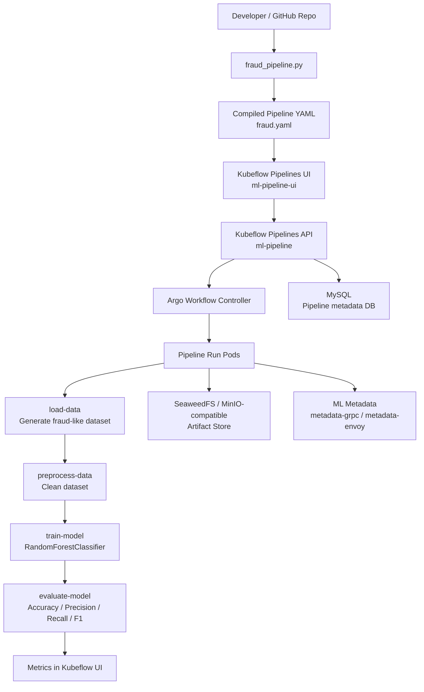
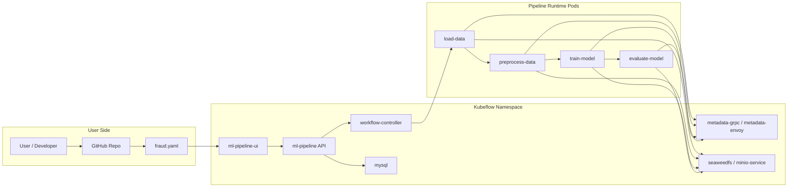
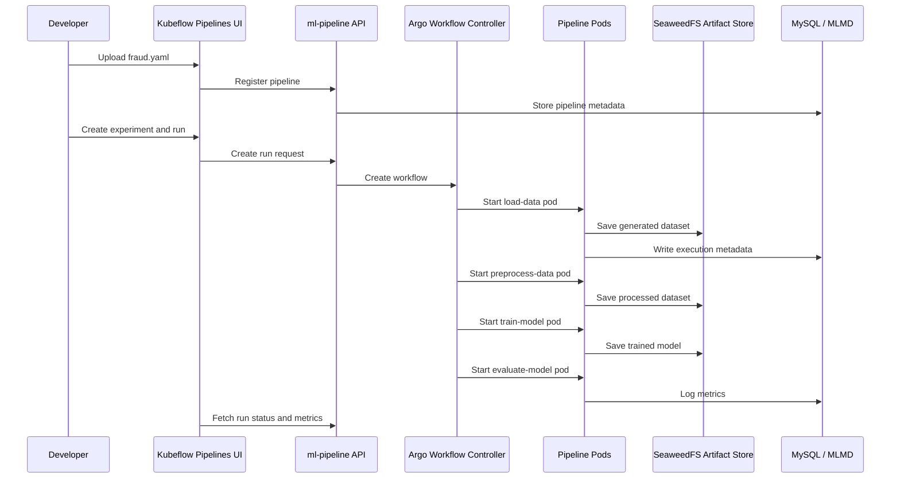

# Kubeflow Fraud Detection Pipeline Architecture

## Overview

This project implements a fraud detection machine learning workflow using Kubeflow Pipelines on Kubernetes/GKE.

The pipeline is written in Python using the KFP DSL, compiled into a YAML pipeline definition, uploaded into Kubeflow Pipelines, and executed as Kubernetes pods through Argo Workflows.

## Architecture Diagram

## Component Diagram

## Pipeline Flow

## Pipeline Steps

| Step | Purpose | Output |
|---|---|---|
| `load-data` | Creates an imbalanced synthetic fraud-like dataset | Raw dataset artifact |
| `preprocess-data` | Reads dataset and removes missing values | Processed dataset artifact |
| `train-model` | Trains a `RandomForestClassifier` | Model artifact |
| `evaluate-model` | Calculates metrics | Accuracy, precision, recall, F1 score |

## Kubernetes / Kubeflow Components

| Component | Role |
|---|---|
| `ml-pipeline-ui` | Web UI for uploading pipelines, creating experiments, and starting runs |
| `ml-pipeline` | Backend API server for pipelines, experiments, and runs |
| `workflow-controller` | Argo controller that launches pipeline tasks as Kubernetes pods |
| `mysql` | Stores pipeline, run, and experiment metadata |
| `metadata-grpc` / `metadata-envoy` | ML Metadata service for lineage and artifact metadata |
| `seaweedfs` / `minio-service` | S3-compatible artifact storage |
| `pipeline-runner` | Service account used by pipeline run pods |

## Runtime Flow

1. Developer writes `fraud_pipeline.py`.
2. Pipeline is compiled into `fraud.yaml`.
3. `fraud.yaml` is uploaded into Kubeflow Pipelines UI.
4. User creates an experiment.
5. User starts a one-off run.
6. `ml-pipeline` creates an Argo Workflow.
7. Argo launches one Kubernetes pod per pipeline step.
8. Artifacts are written to SeaweedFS.
9. Metadata is written to MySQL and MLMD.
10. Metrics are displayed in the Kubeflow Pipelines UI.

## Important Metrics

For fraud detection, accuracy alone can be misleading because fraud data is usually imbalanced.

The most useful metrics are:

- `precision`
- `recall`
- `f1_score`
- `accuracy`

Recall and F1 score are especially important when the goal is to catch rare fraud cases.

